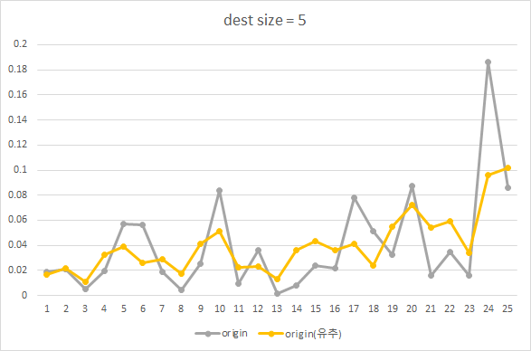

# Top-K-Route-with-spark

### 목적
- 노이즈가 추가된 위치정보를 바탕으로 원본 데이터 유추
- 플로우 요약
    - noise 데이터를 바탕으로 원본 데이터 유추
        - `noise_data` -> `(Top-K-Route-with-Spark)` -> `유추한 origin_data`
    - 유추한 원본데이터와 실제 원본데이터 비교

### 데이터
- 서울 택시데이터(공공데이터) 위치정보 데이터

### 과정
1. [택시 데이터 프로세싱](src/main/scala/smu/datalab/spark/MakeOriginData.scala)
    - 택시 위치정보를 바탕으로 지역별 이동 확률 계산 (출발지 -> 도착지)
    - 최종 저장 데이터 프레임 스키마
    
     |    컬럼명    |  타입  |             설명            |                     예시                     |
      |:------------:|:------:|:---------------------------:|:--------------------------------------------:|
      | origin_start | String | 출발지 위치정보(비트스트림) |     지역 개수를 5로 설정했을 때 ex) 10000    |
      |  origin_end  | String | 도착지 위치정보(비트스트림) |     지역 개수를 5로 설정했을 때 ex) 01000    |
      |     prob     | Double | 출발지에서 도착지로 갈 확률 | 출발지 A에서 출발지 B로 갈 수 있는 모든 확률 |

2. [택시 데이터 노이즈 추가](src/main/scala/smu/datalab/spark/MakeNoiseData.scala)
    - 택시 데이터(비트스트림)에 노이즈 추가
    - 최종 저장 데이터 프레임 스키마
    
    |    컬럼명   |   타입  |                    설명                   |                  예시                 |
    |:-----------:|:-------:|:-----------------------------------------:|:-------------------------------------:|
    |  T_Link_ID  |  String |                택시 고유 ID               |                   -                   |
    |     Day     | Integer |               택시 승차 날짜              |      1~7까지의 범위 (1:월, 7:일)      |
    |     Time    | Integer |               택시 승차 시간              |            0~47 까지의 범위           |
    |    start    |  String |               택시 승차 위치              |    승차한 지역구 고유 번호 ex) 1130   |
    |     end     |  String |               택시 하차 위치              |    하차한 지역구 고유 번호 ex) 1130   |
    | noise_start | String  | 노이즈 추가한 택시 승차 위치 (비트스트림) | 지역 개수를 5로 설정했을 때 ex) 10110 |
    | noise_end   | String  | 노이즈 추가한 택시 하차 위치 (비트스트림) | 지역 개수를 5로 설정했을 때 ex) 10110 |
    
3. [EM 과정을 수행하기 위한 데이터 생성](src/main/scala/smu/datalab/spark/MakeEStepInitData.scala)
    - 추후 `Top K` 수행 과정에 필요한 데이터 생성
    - 최종 저장 데이터 프레임 스키마
    
    |    컬럼명    |  타입  |             설명            |                     예시                     |
    |:------------:|:------:|:---------------------------:|:--------------------------------------------:|
    | noise_start | String | 노이즈 추가된 출발지 위치정보(비트스트림) |     지역 개수를 5로 설정했을 때 ex) 11100    |
    | origin_start | String | 출발지 위치정보(비트스트림) |     지역 개수를 5로 설정했을 때 ex) 10000    |
    |  noise_end  | String | 노이즈 추가된 도착지 위치정보(비트스트림) |     지역 개수를 5로 설정했을 때 ex) 01010    |
    |  origin_end  | String | 도착지 위치정보(비트스트림) |     지역 개수를 5로 설정했을 때 ex) 01000    |
    |     prob     | Double | origin_start가 노이즈를 추가해서 noise_start가 될 확률 * origin_end가 노이즈를 추가해서 noise_end가 될 확률 | - |
          
4. [Top K Route](src/main/scala/smu/datalab/spark/TopK.scala)
    - 1, 2, 3 과정을 반드시 미리 수행해야 함
    - `threshold` 값 또는 `iterationCnt` 의 값으로 원본 데이터 유추 반복 횟수 설정
    - 최종 저장 데이터 프레임 스키마
    
    |    컬럼명    |  타입  |             설명            |                     예시                     |
    |:------------:|:------:|:---------------------------:|:--------------------------------------------:|
    | origin_start | String | 출발지 위치정보(비트스트림) |     지역 개수를 5로 설정했을 때 ex) 10000    |
    |  origin_end  | String | 도착지 위치정보(비트스트림) |     지역 개수를 5로 설정했을 때 ex) 01000    |
    |  origin_prob  | Double | 원본 데이터 지역 이동 확률 |    -|
    |     noise_prob     | Double | 유추 데이터 지역 이동 확률 | - |

### 이미지 예시
